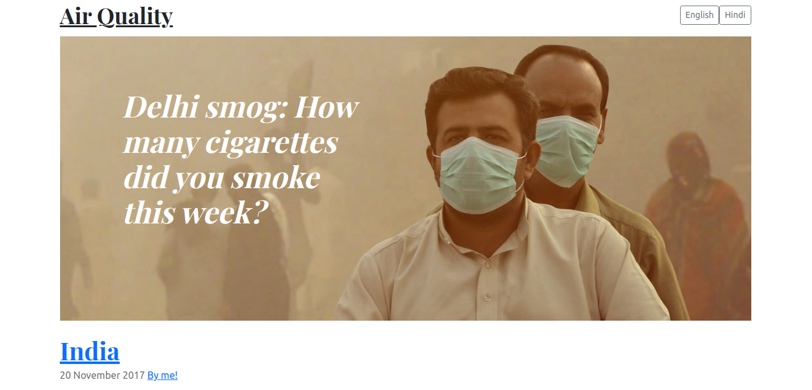
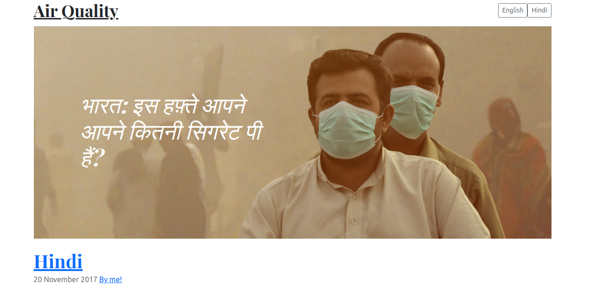
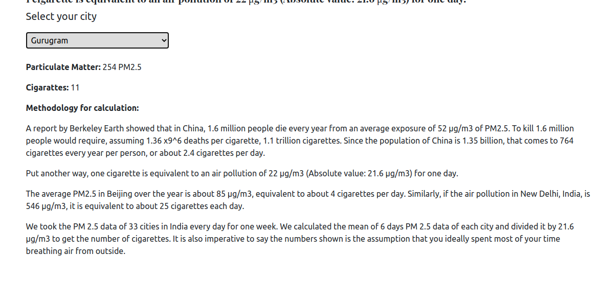
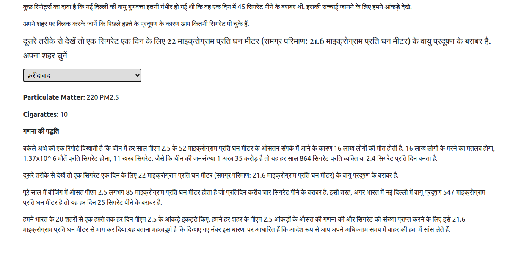

# Table of Contents

- [About the project](#About-the-project)
- [Live Demo](#Live-Demo)
- [Screenshots](#Screenshots)
- [Functionality](#Functionality)
- [Technologies](#Technologies)
  - [Front-end](#Front-end)
- [Issues / PR](#Issues-/-PR)
- [How to run](#How-to-run)

# About the project

This is a project that enables the user to select a city in india and see a display of
their air quality displayed in cigarettes and particulate matter. The project is hosted on aws s3.

# Live Demo

<a title="Deployed on aws" href="http://bbc-news-test.s3-website-us-east-1.amazonaws.com/">http://bbc-news-test.s3-website-us-east-1.amazonaws.com/
</a>

# Screenshots

<details><summary>English Version Hero Section</summary>
<p>

</p>
</details>
<details><summary>Indian Version Hero Section</summary>
<p>

</p>
</details>
<details><summary>English Version Dropdown Section</summary>
<p>

</p>
</details>
<details><summary>Indian Version Dropdown Section</summary>
<p>

</p>
</details>

# Functionality

- [x] Ability to switch languanges between english and hindi
- [x] Ability for users to choose a city and see air quality in the form of cigarettes and particulate matter (PM2.5)
- [x] All production files output are in a ./dist folder ready for making live.
- [x] Tests

# Technologies

## Front-end

- [React](https://create-react-app.dev/)
- [Bootstrap](https://getbootstrap.com/)
- [Webpack](https://webpack.js.org/)
- [Github actions](https://lab.github.com/MSUSDEV/build-end-to-end-cicd-capabilities-directly-in-github)
- [AWS-S3](https://aws.amazon.com/s3/)

# How to run

Don't forget to configure .env file at the root of the project, use the following data:

```
SKIP_PREFLIGHT_CHECK=true
```

```bash
# Clone the repo
$ git clone https://github.com/josphinenzila/air_quality_bbc_test.git
# cd to the project directory
$ cd air_quality_bbc_test
# Install dependancies
$ npm i
# npm run build to build the production files on dist folder
$ npm run build
# npm run to start the server
$ npm start

```

# How to run tests

Note that to run tests you use the command:

```
$ npm run test
```
